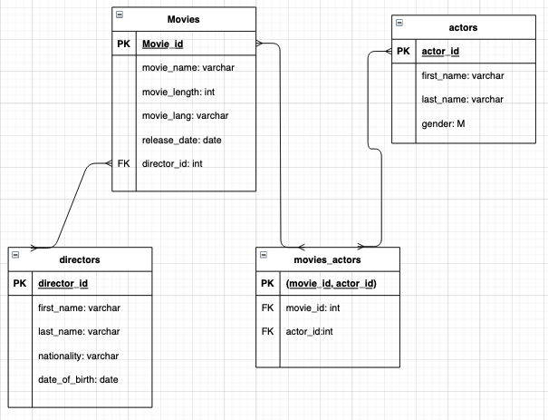

# docker-checkpoint
create a fullstack web app, with CRUD functionality, that is deployable in docker

going to re make a crappy IMDB, yet again

## to run the app:
```
$ docker-compose up -d
```
the client will take port 3000 and the API will take 8080


TODO:

## 1. make the front end

- make a new directory and in that directory create a react app
```
$ npx create-react-app client
```
- make a dockerfile for the client app (./docker-checkpoint/client/Dockerfile)

## 2. make the backend
- in the root make a new dir for the server
- cd into that dir and make it an node js project so we can use express
```
$ npm init
```
- create a simple ReST API with express

- install knex into your project, create your initial migrations, and seed data
>ERD could look something like this:



- add nodemon or similar to the ```yarn start``` scripts in each projects, then add a pass a volume to the client and server containers (see below). this will make your code live reload in their containers

- make your migrations happen via docker on start up

>this is the ```docker-compose.yml``` that does migrations on build:
```
version: '3.1'
services:
  db:
    image: postgres
    environment:
      POSTGRES_USER: admin
      POSTGRES_PASSWORD: password
      POSTGRES_DB: postgres

  client:
    build: client/
    volumes:
      - /Users/mbp19/Desktop/galvanize/docker-checkpoint/client/:/src/app
    depends_on: 
      - db
    ports:
      - 3000:3000
    
  server: 
    build: server/
    volumes:
      - /Users/mbp19/Desktop/galvanize/docker-checkpoint/server/:/src/app
    depends_on:
      - db
    ports:
      - 8080:8080
    command: sh -c "npx knex migrate:latest && npx knex seed:run && npm start" 

```
## 3. pull the movies and directors data into the front end
- make your react app pull from the api and map out the movies and directors

## 4. make an end point on the api that can handle a post

## 5. make an event handler that can post a movie or director